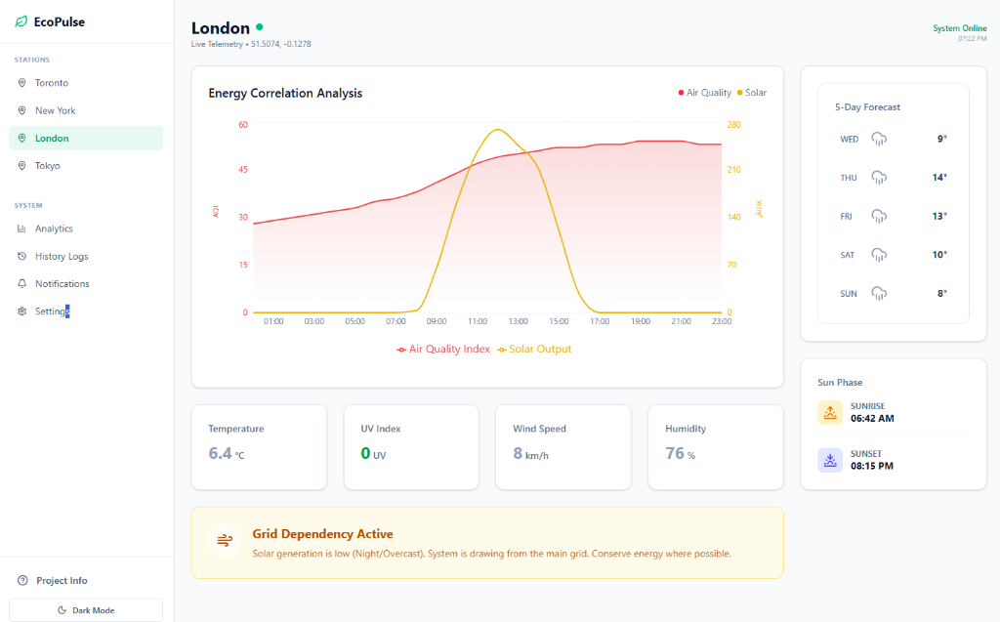
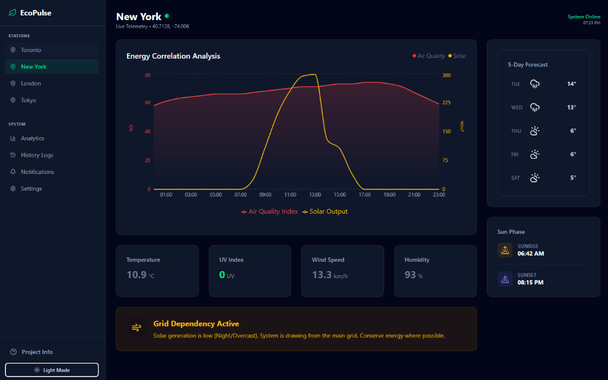
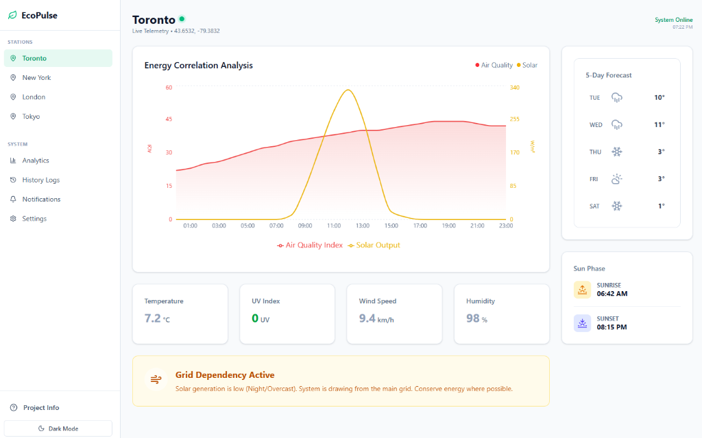
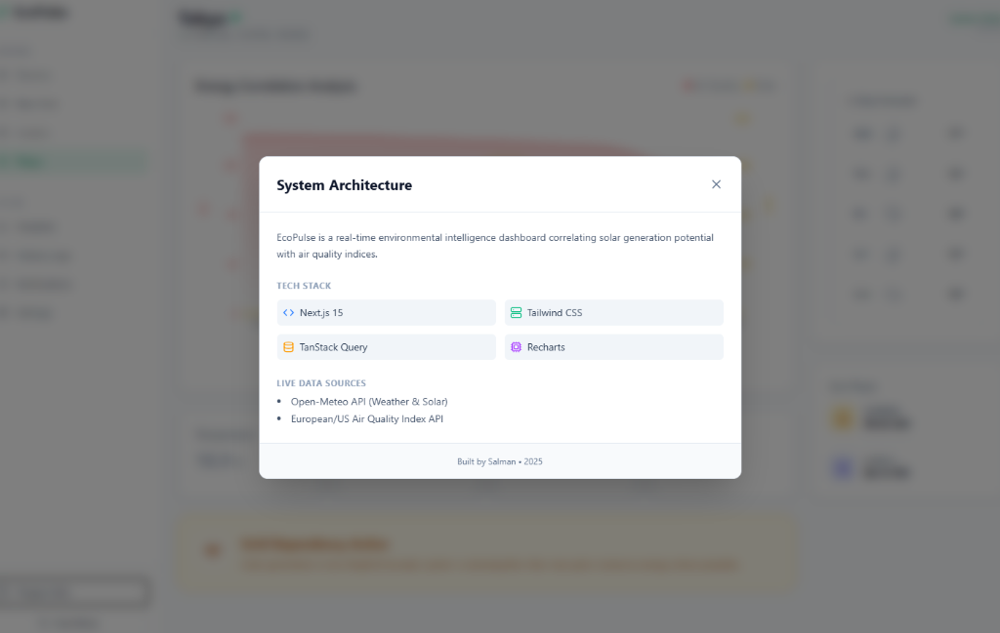

# EcoPulse - Real-Time Environmental Intelligence Dashboard

**Live Demo:** [https://ecopulse-dashboard.netlify.app/](https://ecopulse-dashboard.netlify.app/)



## ⚡ Overview
EcoPulse is a real-time intelligence dashboard that correlates local weather conditions with environmental impact metrics. It visualizes the inverse relationship between **Solar Generation Potential** and **Air Quality Index (AQI)**, proving that renewable energy availability often correlates with better environmental conditions.

### 📸 Feature Showcase

#### 🌓 Light & Dark Mode Support
Seamlessly switch between themes with a persistent, system-aware preference toggle.
| Light Mode | Dark Mode |
|------------|-----------|
|  |  |

#### 📊 Advanced Correlation Analysis
Visualizes the complex relationship between Solar Generation (Yellow) and Air Quality Index (Red) over time.


#### 🌡️ Detailed Weather Telemetry
Real-time widgets displaying Temperature, UV Index, Wind Speed, and Humidity with trend indicators.


#### ℹ️ Project Architecture
Built-in documentation modal explaining the tech stack and data flow.


Designed to demonstrate robust handling of asynchronous data streams, complex state management, and data visualization in Next.js.

## 🛠 Tech Stack
* **Framework:** Next.js 16 (App Router)
* **Language:** TypeScript (Strict)
* **State Management:** TanStack Query (React Query)
* **Visualization:** Recharts (Composed Dual-Axis Charts)
* **Styling:** TailwindCSS + Shadcn/UI
* **APIs:** Open-Meteo (Weather & Air Quality)

## 🚀 Key Features

### 1. Dual-Axis Correlation Analysis
The core visualization overlays two disparate data sets:
* **Solar Output (W/m²):** Visualized as a trend line (Yellow).
* **Air Quality (AQI):** Visualized as a gradient area chart (Red).
* **Engineering Challenge:** These datasets come from different API endpoints with different array structures. I implemented a **Normalization Layer** to zip these streams together by timestamp, ensuring accurate X-Axis synchronization.

### 2. Timezone-Aware Data Processing
The dashboard automatically detects the target region's timezone (America/Toronto) and aligns the UI to match.
* *Problem Solved:* Raw API data is UTC. Browser is Local.
* *Solution:* Implemented custom hour-matching logic to ensure the "Current Conditions" card always reflects the actual hour of the day, preventing "Midnight Data" from showing up at Noon.

### 3. Resilient Data Layer
* **Parallel Fetching:** Uses `Promise.all` to fetch Weather and AQI data simultaneously to minimize Time-to-First-Byte (TTFB).
* **Graceful Degradation:** Includes a "Mock Mode" fallback. If the external APIs rate-limit or fail, the application silently switches to a local dataset to prevent white-screen crashes during demos.

## 📦 Running Locally

1. Clone the repo:
   ```bash
   git clone https://github.com/yourusername/ecopulse.git
   ```

2. Install dependencies:
   ```bash
   npm install
   ```

3. Run the dev server:
   ```bash
   npm run dev
   ```

Built by Salman
